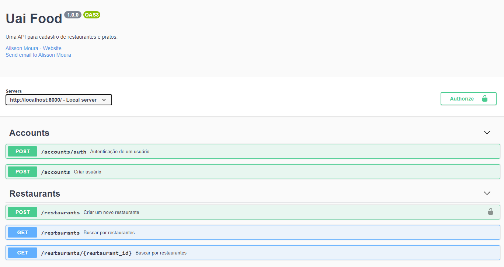

<!-- PROJECT LOGO -->
<br />
<p align="center">
  <a href="https://github.com/alisson-moura/uai-food">
    
  </a>

  <p align="center">
    Uma API de cadastro de restaurantes e pratos.
  </p>
</p>

<details open="open">
  <summary>Tabela de Conteúdos</summary>
  <ol>
   <li><a href="#pré-requisitos">Pré-requisitos</a></li>
    <li><a href="#clonando-o-repositório">Clonando o repositório</a></li>
    <li><a href="#testes-unitários">Testes unitários</a></li>
    <li><a href="#acessando-a-documentação">Acessando a documentação</a></li>
    <li><a href="#tecnologias-utilizadas">Tecnologias utilizadas</a></li>
    <li><a href="#contato">Contato</a></li>
  </ol>
</details>

### Pré-requisitos
Antes de começar, você vai precisar ter instalado em sua máquina as seguintes ferramentas:
[Git](https://git-scm.com), [Node.js](https://nodejs.org/en/). 

Também será necessário a conexão com um banco de dados postgres. Você pode alterar os parâmetros de conexão no arquivo "ormconfig.json" que está na raiz do projeto. Caso você tenha o docker instalado em sua máquina pode executar o seguinte comando na raiz do projeto para subir um container com a base de dados já criada.

```bash
$ docker-compose up -d
```

### Clonando o repositório

```bash
# Clone este repositório
$ git clone https://github.com/alisson-moura/uai-food

# Acesse a pasta do projeto no terminal/cmd
$ cd uai-food

# Instale as dependências
$ npm install
```

Após clonar e instalar as dependências do projeto é necessário rodar as migrations para criar as tabelas no banco de dados, então após subir o banco de dados postgres com a base de dados uai_food criada, executar o seguinte comando:


```bash
$ npm run typeorm migration:run
```

E para iniciar a aplicação:
```bash
$ npm start
```

A API ficara disponível no endereço "http://localhost:8000".

### Testes unitários
A api tem uma cobertura de testes unitários, para rodar os testes basta executar:
```bash
npm run test
```

### Acessando a documentação
A documentação da aplicação contém os dados necessários para usar corretamente os endpoints, para visualizar a documentação basta acessar no seu navegador: http://localhost:8000/
<p align="center">
    
</p>


### Tecnologias utilizadas
As seguintes ferramentas foram usadas na construção do projeto:
- [Node.js](https://nodejs.org/en/)
- [TypeScript](https://www.typescriptlang.org/)
- [TypeOrm](https://typeorm.io/#/)
- [Swagger](https://swagger.io/specification/)


## Contato

 <br />
<b>Alisson Moura 👋🏽 [Entre em contato!](https://www.linkedin.com/in/alisson-mo-moura/) </b>
 

